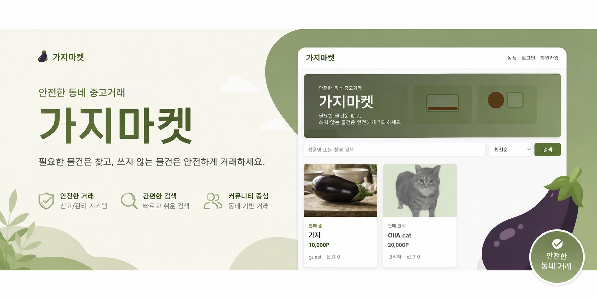

# 가지마켓(gazimarket)

> WHS 4기 김태은 시큐어 코딩 과제 



## 문서

- [설치 및 실행 방법](SETUP.md)
- [요구사항 및 시스템 설계](DESIGN.md)

## 빠른 실행

```bash
python3 -m venv .venv
. .venv/bin/activate
pip install -r requirements.txt
bash scripts/serve.sh
```

브라우저에서 `http://127.0.0.1:5000`으로 접속합니다.

세부 환경 구성, 직접 실행, ngrok 외부 공개 방법은 [SETUP.md](SETUP.md)를 확인하세요.

## 포함 기능

- 회원가입, 로그인, 마이페이지
- 아이디 찾기, 비밀번호 찾기
- 상품 등록, 검색, 상세 조회, 수정, 삭제
- 가상 포인트 송금 및 거래
- 전체 채팅 및 상품별 1:1 채팅
- 상품/사용자 신고
- 관리자 회원, 상품, 신고 관리

## flow chart (세부 사항은 보고서 참조)
